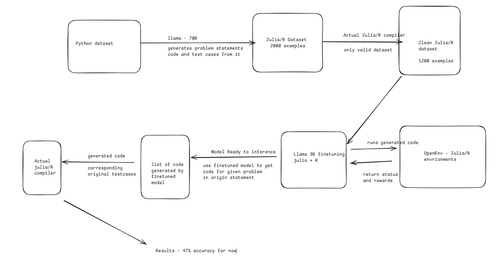

Blog link - https://medium.com/@yogeshsingla481/training-a-multi-language-3b-coder-lm-with-reinforcement-learning-grpo-f37577d5e5f7

Must Read for complete picture


# Fine-tuning Modes for Underrepresented Programming Languages using Reinforcement Learning

## Problem Statement

Large Language Models (LLMs) like GPT-4, Claude, and Llama have shown impressive capabilities in generating code for popular programming languages such as Python, JavaScript, and Java. However, their performance significantly degrades when working with less mainstream programming languages like **Julia** and **R**. This limitation creates a barrier for data scientists, researchers, and domain experts who rely on these specialized languages.

While models like Llama 3.2 7B are compact and efficient, they often struggle with:
- Generating syntactically correct code in less common languages
- Understanding domain-specific patterns and idioms
- Following language-specific best practices
- Handling specialized libraries and frameworks

**Our Goal**: Fine-tune a small, efficient model ([unsloth/Llama-3.2-7B-Instruct](https://huggingface.co/unsloth/Llama-3.2-7B-Instruct)) using Reinforcement Learning to achieve strong performance on underrepresented programming languages, making specialized language assistance more accessible and cost-effective.

## Approach

We leverage **Unsloth** for efficient fine-tuning and **GRPO (Group Relative Policy Optimization)** for reinforcement learning to improve model performance on Julia and R programming languages.

### Key Technologies

- **Unsloth**: A high-performance library for efficient LLM fine-tuning with reduced memory usage
- **GRPO (Group Relative Policy Optimization)**: An advanced RL algorithm for aligning language models
- **[unsloth/Llama-3.2-7B-Instruct](https://huggingface.co/unsloth/Llama-3.2-7B-Instruct)**: A compact yet powerful base model that we fine-tune for Julia and R code generation
- **[unsloth/Llama-3.3-70B-Instruct](https://huggingface.co/unsloth/Llama-3.3-70B-Instruct)**: Larger model used for dataset generation to convert Python problems to Julia and R
- **OpenEnv**: An end-to-end framework for creating, deploying, and using isolated execution environments for agentic RL training, built using Gymnasium-style simple APIs

### Methodology

1. **Dataset Generation**: Convert Python programming problems to Julia and R using Llama 3.3 70B Instruct
2. **Code Validation**: Filter through compiler and test framework to ensure correctness
3. **GRPO Training with Execution-Based Rewards**: Train Llama 3.2 7B using reinforcement learning with feedback from code execution
4. **Evaluation**: Test model performance on both languages

### Why Two Different Models?

We employ a **two-model strategy** for optimal efficiency and performance:

- **Dataset Generation: [Llama 3.3 70B Instruct](https://huggingface.co/unsloth/Llama-3.3-70B-Instruct)**
  - Larger, more capable model for high-quality dataset creation
  - Better at understanding complex Python code and translating to Julia/R
  - Used offline for one-time dataset generation
  - Ensures high-quality training data

- **Model Training: [Llama 3.2 7B Instruct](https://huggingface.co/unsloth/Llama-3.2-7B-Instruct)**
  - Smaller, efficient model that can be deployed easily
  - Fast inference for real-time code generation
  - Cost-effective for production deployment
  - Can run on consumer hardware after fine-tuning

This approach combines the strengths of both models: leveraging the 70B model's superior capabilities for creating a high-quality dataset, then distilling that knowledge into a compact 7B model that's practical for real-world use.

## Dataset Generation

One of the key challenges in training LLMs for underrepresented languages is the **lack of high-quality datasets**. Most LLM benchmarks and training datasets are heavily skewed toward Python, with limited resources for languages like Julia and R.

### Our Approach: Dataset Conversion Pipeline

Since existing datasets for Julia and R are scarce, we developed a pipeline to convert Python programming problems into equivalent Julia and R problems with compilable code and unit tests.

#### Step 1: Source Dataset Selection

We started with the **[Ace-Code-87k dataset](https://huggingface.co/datasets/BAAI/Infinity-Instruct)**, which contains Python programming problems with descriptions and solutions. We randomly sampled **2,000 prompts** from this dataset to create our base corpus.

#### Step 2: Code and Test Generation

We used **[Llama 3.3 70B Instruct](https://huggingface.co/unsloth/Llama-3.3-70B-Instruct)** to:
1. Convert Python problem descriptions to Julia/R equivalents
2. Generate syntactically correct Julia/R code solutions
3. Create comprehensive unit tests for each solution

**Example transformation:**
```
Python Prompt → Llama 3.3 70B Instruct → Julia/R Prompt + Code + Unit Tests
```

#### Step 3: Validation Through Compilation and Testing

This is the **critical filtering step** that ensures dataset quality:

```
For each generated (prompt, code, unit_test) triple:
├─ Compile the code using Julia/R compiler
├─ If compilation fails → Discard
├─ If compilation succeeds → Run unit tests
├─ If tests fail → Discard
└─ If tests pass → Include in dataset ✓
```

The code and unit tests were run through:
- **Julia Compiler**: Validates Julia syntax and semantics
- **R Interpreter**: Validates R syntax and semantics
- **Testing Frameworks**: Executes unit tests to verify correctness

#### Step 4: Final Dataset

After filtering, we obtained **1,200 high-quality (prompt, code, unit_test) triples** for each language (60% success rate from 2,000 initial samples):
- ✅ All code is **compilable** (no syntax errors)
- ✅ All code **passes unit tests** (functionally correct)
- ✅ Problems cover diverse programming concepts
- ✅ Ready for RL training and evaluation

**Key Insight**: The 60% success rate (1,200/2,000) demonstrates that even state-of-the-art models like Llama 3.3 70B Instruct struggle with underrepresented languages, validating the need for specialized fine-tuning.

This curated dataset forms the foundation for our GRPO training, ensuring the model learns from correct, executable examples.

### Dataset Files

- `julia_dataset.parquet`: 1,200 validated Julia programming problems
- `r_dataset.parquet`: 1,200 validated R programming problems

## Training Flow

Our training approach uses **execution-based rewards** to teach the model to generate correct, working code:

```
┌─────────────────────────────────────────────────────────────┐
│                    Training Episode                          │
└─────────────────────────────────────────────────────────────┘
                              │
                              ▼
        ┌──────────────────────────────────────┐
        │  1. Input: Problem Description       │
        │     - Function requirements          │
        │     - Expected behavior              │
        │     - Test cases                     │
        └──────────────────────────────────────┘
                              │
                              ▼
        ┌──────────────────────────────────────┐
        │  2. Model Generates Code Solution    │
        │     - Llama 3.2 7B Instruct (RL)    │
        │     - Outputs Julia/R code          │
        └──────────────────────────────────────┘
                              │
                              ▼
        ┌──────────────────────────────────────┐
        │  3. Code Compilation Check           │
        │     - OpenEnv: Isolated Julia/R env  │
        │     ✓ Valid syntax → Continue        │
        │     ✗ Syntax error → Negative reward │
        └──────────────────────────────────────┘
                              │
                              ▼
        ┌──────────────────────────────────────┐
        │  4. Execute Test Cases               │
        │     - OpenEnv: Safe execution        │
        │     - Run provided unit tests        │
        │     - Check outputs vs expected      │
        │     - Capture runtime errors         │
        └──────────────────────────────────────┘
                              │
                              ▼
        ┌──────────────────────────────────────┐
        │  5. Calculate Reward                 │
        │     🏆 All tests pass: High reward   │
        │     ⚠️  Some tests pass: Partial     │
        │     ❌ No tests pass: Low reward     │
        │     💥 Won't compile: Negative       │
        └──────────────────────────────────────┘
                              │
                              ▼
        ┌──────────────────────────────────────┐
        │  6. Update Model via GRPO            │
        │     - Adjust policy based on reward  │
        │     - Reinforce correct patterns     │
        │     - Discourage errors              │
        └──────────────────────────────────────┘
```

### Reward Structure

Our reward function evaluates generated code on multiple criteria:

| Criterion | Reward | Description |
|-----------|--------|-------------|
| **Compilation Failure** | -1.0 | Code has syntax errors and won't compile |
| **Runtime Error** | -0.5 | Code compiles but crashes during execution |
| **Failed Tests** | 0.0 - 0.5 | Code runs but fails some/all test cases |
| **All Tests Pass** | +1.0 | Code compiles, runs, and passes all tests |
| **Bonus: Efficiency** | +0.1 - 0.3 | Additional reward for clean, efficient code |

This approach ensures the model learns to:
- Write **syntactically correct** code that compiles
- Produce **functionally correct** code that passes tests
- Understand **language-specific** execution semantics
- Avoid common pitfalls and runtime errors

### Isolated Execution with OpenEnv

We use **OpenEnv** to create safe, isolated execution environments for testing generated code. OpenEnv provides:

- **Gymnasium-style APIs**: Simple, standardized interface for RL training
- **Language-specific environments**: Separate Julia and R execution sandboxes
- **Isolation & Safety**: Prevents generated code from affecting the host system
- **Resource Management**: Controls memory, CPU, and execution time limits
- **Reproducibility**: Consistent environment across training runs

**Benefits for RL Training:**


This architecture ensures that:
- **Training is safe**: Malformed or malicious code runs in isolation
- **Feedback is reliable**: Consistent execution environment provides stable rewards
- **Scaling is easy**: Multiple environments can run in parallel for faster training

### Custom Julia and R Environments

We extended OpenEnv to support Julia and R by creating custom execution environments. These environments are available in our forked repository:

**🔗 [OpenEnv Julia & R Environments](https://github.com/yogesh1801/OpenEnv/tree/yogesh-julia-env)**

Our custom environments provide:
- **Julia Compiler Integration**: Full Julia 1.9+ support with package management
- **R Interpreter Integration**: R 4.3+ support with CRAN packages
- **Test Framework Support**: Native unit testing for both languages
- **Error Handling**: Detailed compilation and runtime error messages
- **Reward Calculation**: Automatic scoring based on test results

These environments can be used independently for any Julia/R code generation or testing tasks beyond this project.

## Project Structure

```
amd-hackathon/
├── julia/
│   ├── julia_generate_dataset.ipynb    # Generate Julia dataset using Llama 3.3 70B
│   ├── julia_clean_dataset.ipynb       # Clean and preprocess Julia data
│   ├── julia_dataset_check.ipynb       # Validate Julia dataset quality
│   ├── julia_grpo.ipynb                # Train Llama 3.2 7B on Julia (GRPO)
│   └── julia_dataset.parquet           # 1,200 validated Julia problems
│
├── R/
│   ├── r_generate_dataset.ipynb        # Generate R dataset using Llama 3.3 70B
│   ├── r_dataset_check.ipynb           # Validate R dataset quality
│   ├── r_grpo.ipynb                    # Train Llama 3.2 7B on R (GRPO)
│   └── r_dataset.parquet               # 1,200 validated R problems
│
├── unified_grpo.ipynb                   # Train Llama 3.2 7B on both languages
├── julia_dataset.parquet                # Root Julia dataset (1,200 problems)
├── r_dataset.parquet                    # Root R dataset (1,200 problems)
└── README.md
```

### Training Notebooks

We provide three Jupyter notebooks for flexible training:

1. **`julia/julia_grpo.ipynb`**
   - Trains [unsloth/Llama-3.2-7B-Instruct](https://huggingface.co/unsloth/Llama-3.2-7B-Instruct) specifically on Julia code generation
   - Uses OpenEnv Julia environment for code execution and reward calculation
   - Best for Julia-only use cases

2. **`R/r_grpo.ipynb`**
   - Trains [unsloth/Llama-3.2-7B-Instruct](https://huggingface.co/unsloth/Llama-3.2-7B-Instruct) specifically on R code generation
   - Uses OpenEnv R environment for code execution and reward calculation
   - Best for R-only use cases

3. **`unified_grpo.ipynb`**
   - Trains [unsloth/Llama-3.2-7B-Instruct](https://huggingface.co/unsloth/Llama-3.2-7B-Instruct) on both Julia and R simultaneously
   - Leverages both OpenEnv environments
   - Creates a multi-language code generation model
   - **Recommended** for maximum versatility

After training, all models can be used for inference with OpenEnv for real-time code validation.

## Target Languages

### Julia
Julia is a high-performance language for technical computing, popular in:
- Scientific computing
- Data science
- Machine learning
- Numerical analysis

### R
R is a statistical programming language widely used in:
- Statistical analysis
- Data visualization
- Bioinformatics
- Academic research

## Why This Matters

By making high-quality code assistance available for specialized programming languages, we:
- **Democratize AI tools** for researchers and data scientists
- **Reduce barriers** to using domain-specific languages
- **Improve productivity** in scientific and statistical computing
- **Enable efficient deployment** with smaller, fine-tuned models

## Future Work

- Extend support to additional underrepresented languages (Haskell, Fortran, MATLAB)
- Implement code execution validation in the training loop
- Create benchmarks for specialized language performance
- Develop language-specific evaluation metrics

## Acknowledgments

This project uses:
- [Unsloth](https://github.com/unslothai/unsloth) for efficient LLM training
- [OpenEnv](https://github.com/meta-pytorch/OpenEnv) for isolated execution environments with Gymnasium-style APIs
  - Custom Julia and R environments: [yogesh-julia-env branch](https://github.com/yogesh1801/OpenEnv/tree/yogesh-julia-env)
- Meta's Llama models:
  - [unsloth/Llama-3.2-7B-Instruct](https://huggingface.co/unsloth/Llama-3.2-7B-Instruct) - Model being fine-tuned
  - [unsloth/Llama-3.3-70B-Instruct](https://huggingface.co/unsloth/Llama-3.3-70B-Instruct) - Used for dataset generation
- GRPO (Group Relative Policy Optimization) for reinforcement learning
- [Ace-Code-87k dataset](https://huggingface.co/datasets/BAAI/Infinity-Instruct) as the base Python dataset

